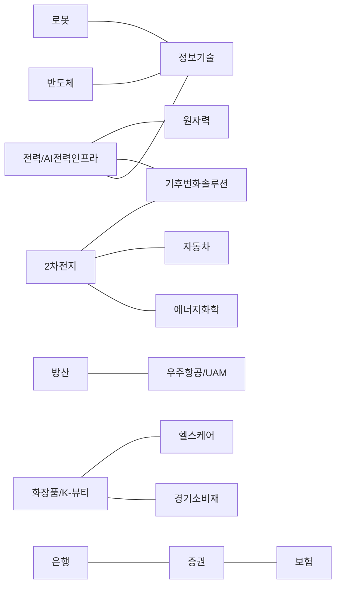

# 한국 주식시장 테마 분류의 적절성 평가와 개선안

## Executive Summary

- 첨부 YAML 파일을 직접 검토한 결과, 현행 분류는 **20개 테마를 ETF/비교지수에 강하게 연동한 구조**였다. 이 방식은 국내 ETF·리테일 투자자에게는 직관적이지만, **KRX·KSIC 기반 산업축**과 **정책·기술 중심 테마축**이 같은 레벨에 섞여 있어 연구·데이터용 마스터 분류로 쓰기에는 구조적 한계가 있다. KRX는 상장법인 업종을 한국표준산업분류와 매출 비중에 따라 분류하고, 주요 운용사는 이미 **섹터/국가**와 **테마**를 별도 카테고리로 운영한다. citeturn22view0turn24view0turn3search1turn13search9turn7search3

- 핵심 문제는 **레벨 혼합과 중복**이다. 공식 자료상 전력/AI전력인프라는 AI 데이터센터 수요와 전력설비 기업을 함께 묶고, 조선은 조선·해운을 같이 담으며, HANARO K-뷰티는 화장품과 필러·보톡스를 함께 포함한다. PLUS K방산과 PLUS 우주항공&UAM은 상위 편입 종목이 상당 부분 겹친다. 이는 “산업”, “밸류체인”, “정책/내러티브”가 분리되지 않았음을 뜻한다. citeturn11search4turn20search1turn17view2turn28view0turn17view1

- 포괄성도 완전하지 않다. 미래에셋은 혁신성장 테마에서 **인터넷TOP10·게임TOP10**을 별도 제시하고, 삼성자산운용은 **KODEX 건설**과 **친환경조선해운액티브**를, NH-Amundi는 **Fn5G산업·Fn전기&수소차·전력설비투자**를 제공한다. 즉, 투자자 관점에서 이미 독립된 사용성을 가진 영역이 현행 첨부 분류에 일부 누락돼 있다. citeturn7search3turn6search2turn6search3turn6search13turn16search12

- 가장 적절한 개선안은 **이중 축 분류**다. 모든 종목에 **기본산업 태그 1개**를 부여하고, 그 위에 **교차테마 태그 0개 이상**을 추가하는 구조다. 이렇게 하면 ETF 검색 편의성은 유지하면서도, 산업 리서치·퀀트 태깅·백테스트에서의 이중집계와 명칭 드리프트를 줄일 수 있다. 또한 최근 국내 테마형 자금이 전력과 로봇 등으로 빠르게 이동하고, ETF 명칭 변경도 빈번하므로, taxonomy에는 **alias/history/유효기간 버전 관리**가 필수적이다. citeturn8search1turn8search3turn26search11turn1search6turn6search6turn27view0

## 평가 범위와 기준

첨부 YAML 파일에는 20개 테마가 식별되었다. 파일 구조상 각 테마는 1개의 대표 ETF 또는 비교지수에 연결되어 있었고, authority priority는 `ETF_PRODUCT_THEME_INDEX > ETF_COMPARISON_INDEX > ASSET_MANAGER_CATEGORY > OFFICIAL_INDEX_OR_INDUSTRY_ANCHOR` 순서였다. 이 설계는 **“무엇이 산업적으로 같은가”보다 “무엇이 현재 투자 상품으로 구현되어 있는가”를 먼저 보는 구조**라고 해석할 수 있다. 이 점은 현행 분류의 장점이자 한계다.

본 평가는 네 가지 기준으로 진행했다. 첫째, **산업 정합성**이다. KRX는 상장법인의 업종을 KSIC와 상장규정 시행세칙상의 업종 코드표에 따라 대분류·중분류·소분류로 나누며, 복수 사업인 경우 매출액 비중이 더 큰 사업을 우선 적용한다. KSIC는 통계의 정확성과 국가 간 비교 가능성을 위해 UN 국제표준산업분류에 기초해 작성된 국내 표준 분류다. citeturn22view0turn24view0turn3search1

둘째, **테마 분류의 계층성**이다. 키움증권은 테마형 ETF 분류 기준이 정보 제공사마다 상이하다고 지적하면서, 모닝스타 사례처럼 대분류-중분류-소분류의 3단계 구조가 유효하다고 정리했다. 미래에셋증권도 ETF가 시장대표/섹터형에서 테마형/액티브형으로 진화했다고 설명한다. 즉, 산업과 테마는 같은 층위의 분류가 아니라 **서로 다른 차원**일 가능성이 높다. citeturn9view1turn21view1turn9view2turn21view2

셋째, **투자자 관점의 유용성**이다. 국내 운용사는 이미 “국가별 섹터”와 “혁신성장테마”를 다른 메뉴로 운영하고, “테크 ETF 리스트” 같은 별도 라인업도 제공한다. 이는 실무적으로도 **섹터 분류와 테마 분류가 별도여야 한다**는 강한 신호다. citeturn13search9turn7search3turn14search13turn7search13

넷째, **데이터 구현 가능성**이다. KRX는 Data Marketplace와 Open API를 통해 시장데이터를 제공하고, 주요 운용사는 구성종목 PDF와 상품 문서를 공개한다. 한국투자 Open API도 국내 업종 일자별·기간별 시세 및 종목정보 파일을 제공하므로, KRX/KSIC를 마스터 축으로 두고 KIS류 브로커 API 업종 체계를 보조 crosswalk로 붙이는 구현이 가능하다. citeturn2search2turn2search3turn10search0turn10search3turn19search15turn11search6

## 현행 분류 진단

현행 첨부 taxonomy의 가장 큰 장점은 **투자 상품과의 연결성**이다. 실제로 주요 운용사는 테마 ETF를 광범위하게 운영하고 있으며, 장기적으로 국내 ETF 시장 자체도 시장대표형에서 테마형·액티브형으로 다변화되어 왔다. 그러나 이런 상품 중심성은 반대로 taxonomy가 **운용사 경쟁, 상품 출시 타이밍, 유행 테마**의 영향을 직접 받게 만든다. KCMI는 국내 테마형 ETF 성장이 투자자 선택의 폭을 넓히는 긍정적 기능을 가졌다고 보면서도, 유행하는 테마를 좇아 출시될 경우 상장 이후 성과가 약하고 상장 시점 편입 종목의 고평가 위험이 존재한다고 지적했다. 따라서 “ETF 탐색용 분류”와 “연구용 마스터 분류”는 분리하는 편이 더 엄밀하다. citeturn27view0turn27view1

### 현행 분류의 총평

| 평가 항목 | 판정 | 판단 요약 |
|---|---|---|
| 포괄성 | 중간 | 핵심 인기 영역은 상당 부분 포함하지만 인터넷/플랫폼, 게임·콘텐츠, 건설·인프라, 5G, 해운·물류 등 투자자 사용 빈도가 높은 영역이 누락 |
| 중복성 | 중간~높음 | 정보기술-반도체-로봇, 방산-우주항공/UAM, 기후변화솔루션-원자력/2차전지/전력, 화장품/K-뷰티-경기소비재/헬스케어가 동시에 존재 |
| 명확성 | 중간 이하 | 파일에 포함 기준·제외 기준·순수노출 임계치가 없고 이름이 지수/상품명 중심 |
| 산업 정합성 | 중간 | KRX/KSIC 산업축과 ETF 내러티브 축이 혼재 |
| 투자자 유용성 | 높음 | ETF 검색과 리테일 해석에는 직관적 |
| 시계열 적응성 | 중간 이하 | 정책·기술 변화에 민감한 명칭과 범위가 많아 버전 관리 필요 |
| 데이터 가용성 | 중간~높음 | KRX·브로커 API·운용사 공개 문서로 태깅은 가능하지만, 규칙 정의가 없으면 재현성이 낮음 |

포괄성이 “중간”인 이유는, 투자자 입장에서 이미 독립된 테마로 쓰이는 영역이 빠져 있기 때문이다. 미래에셋은 “혁신성장테마”에서 인터넷TOP10·게임TOP10을 별도 분류하고 있고, 삼성자산운용은 건설과 친환경조선해운을, NH-Amundi는 5G·전기&수소차·전력설비투자를 독립 상품군으로 제시한다. 따라서 첨부 목록은 **한국 주식시장의 주요 ETF화 가능한 테마를 상당 부분 반영하되, 완전한 coverage는 아니다**고 보는 것이 적절하다. citeturn7search3turn6search2turn6search3turn6search13turn16search12

중복성은 특히 높다. 공식 तथ्य상 전력/AI전력인프라는 AI 데이터센터 확대와 전력설비 기업을 함께 언급하고, 조선 테마는 공식 상품 설명에서 “조선·해운 기업”을 같이 묶는다. HANARO K-뷰티는 화장품과 피부미용, 필러, 보톡스를 포괄하고, PLUS K방산과 PLUS 우주항공&UAM은 한화에어로스페이스·한국항공우주·한화시스템 등 핵심 종목이 실제로 중복된다. 이런 구조에서는 “테마”가 **산업인지, 밸류체인인지, 정책 내러티브인지**가 명확하지 않다. citeturn11search4turn20search1turn17view2turn28view0turn17view1

위 네트워크는 첨부 taxonomy와 공식 상품 설명·구성종목을 바탕으로 본 **개념 및 편입 후보의 중복 관계**를 요약한 것이다. 특히 방산/UAM과 K-뷰티/헬스케어, 반도체/정보기술, 2차전지/에너지화학/자동차는 현행 구조에서 이중 태깅 위험이 높다. citeturn17view1turn28view0turn17view2turn19search2turn13search10

### 첨부 파일 기반 현행 테마 목록 정리

다음 표는 첨부 taxonomy의 20개 현행 테마를 정리한 것이다. 파일에는 대부분 **명시적 선정 규칙이 없었기 때문에**, 정의는 첨부 파일의 기초지수명·상품명과 공식 상품 설명을 바탕으로 보완 추정했다. 특히 방산은 공식적으로 키워드 유사도 스코어링 기반이고, K-뷰티 공식 문서는 키워드 기반 테마 지수가 실제 시장점유율·매출과 괴리될 수 있다고 경고한다. 따라서 아래 표의 “중복 리스크”와 “권고”는 단순 명칭이 아니라 **실제 편입 개념의 불명확성**을 반영한 판단이다. citeturn28view0turn11search10

| 현행 테마 | 정의 | 포함 종목 예시 | 중복 리스크 | 권고 |
|---|---|---|---|---|
| 전력/AI전력인프라 | AI 데이터센터 전력 수요와 송배전·전력기기 CAPEX 수혜 기업 | LS ELECTRIC, HD현대일렉트릭 | 높음 | 분리 |
| 조선 | 조선·해운 관련 국내 대표 기업 | HD현대중공업, 삼성중공업 | 중간 | 분리 |
| 원자력 | 원전 건설·기기·정비·연료 등 원자력 밸류체인 | 두산에너빌리티, 한전KPS | 중간 | 유지 |
| 로봇 | 산업용·서비스 로봇 및 핵심 부품/시스템 | 두산로보틱스, 레인보우로보틱스 | 높음 | 유지 |
| 방산 | 국내 방위산업 핵심 장비·체계 기업 | 한화에어로스페이스, 한국항공우주 | 높음 | 통합 |
| 우주항공/UAM | 위성·발사체·항공전자·UAM 생태계 기업 | 한화시스템, 인텔리안테크 | 높음 | 통합 |
| 화장품/K-뷰티 | 화장품과 미용의료를 포괄하는 K-뷰티 기업 | 에이피알, 휴젤 | 중간 | 명칭 변경 |
| 반도체 | 메모리·비메모리·장비 등 반도체 산업 | 삼성전자, SK하이닉스 | 높음 | 통합 |
| 철강 | 철강 및 일부 비철·광업 관련 소재 | POSCO홀딩스, 고려아연 | 중간 | 명칭 변경 |
| 은행 | 은행업 중심 금융기업 | KB금융, 신한지주 | 높음 | 통합 |
| 증권 | 브로커리지·IB 중심 금융기업 | 미래에셋증권, 한국금융지주 | 높음 | 통합 |
| 보험 | 생명·손해보험 중심 금융기업 | 삼성생명, 삼성화재 | 높음 | 통합 |
| 2차전지 | 배터리 셀·소재·장비 중심 밸류체인 | LG에너지솔루션, 에코프로비엠 | 높음 | 유지 |
| 자동차 | 완성차와 부품 중심 모빌리티 산업 | 현대차, 기아 | 중간 | 명칭 변경 |
| 헬스케어 | 제약·바이오·의료기기·서비스 전반 | 삼성바이오로직스, 셀트리온 | 높음 | 분리 |
| 에너지화학 | 석유·화학·신에너지 일부를 함께 담은 에너지/화학 | LG화학, SK이노베이션 | 높음 | 분리 |
| 경기소비재 | 임의소비재 중심 소비 산업 | F&F, 호텔신라 | 중간 | 명칭 변경 |
| 필수소비재 | 식품·생활용품 등 필수소비 중심 | CJ제일제당, 농심 | 낮음 | 유지 |
| 정보기술 | IT 전반을 포괄하는 광범위 섹터 | 삼성전자, NAVER | 높음 | 분리 |
| 기후변화솔루션 | 탄소감축·효율화·친환경 전환 관련 기업군 | 한화솔루션, 씨에스윈드 | 높음 | 분리 |

대표 예시 종목은 **설명용 대표주**이며, 실제 ETF 편입 비중과 동일함을 뜻하지 않는다. 공식 상품 페이지는 구성종목이 시장 상황에 따라 달라질 수 있음을 명시한다. citeturn17view1turn28view0

## 개선 분류안

현행 분류의 가장 큰 문제는 “한 리스트 안에 서로 다른 축이 섞여 있다”는 점이다. 따라서 개선안은 **기본산업**과 **교차테마**를 분리한 이중 구조를 권고한다. 기본산업은 KRX/KSIC와 정렬되는 **배타적 1차 태그**이고, 교차테마는 AI·에너지전환·국방·K-소비처럼 여러 산업을 가로지르는 **복수 부여 가능한 2차 태그**다. 이 구조는 KRX 업종 규정과 KSIC 표준에 정합적일 뿐 아니라, 실제 운용사 화면에서도 “섹터/국가”와 “테마”가 별개로 운영된다는 점과도 일치한다. 또한 키움증권이 지적한 계층형 테마 분류 구조와도 부합한다. citeturn24view0turn3search1turn13search9turn7search3turn21view1

```mermaid
flowchart TD
    A["개선 분류안"] --> B["기본산업 태그"]
    A --> C["교차테마 태그"]

    B --> B1["금융"]
    B1 --> B11["은행"]
    B1 --> B12["증권·자본시장"]
    B1 --> B13["보험"]

    B --> B2["산업재"]
    B2 --> B21["전력설비"]
    B2 --> B22["조선"]
    B2 --> B23["항공우주·방산"]

    B --> B3["정보기술"]
    B3 --> B31["반도체"]
    B3 --> B32["소프트웨어·플랫폼"]
    B3 --> B33["로봇·자동화"]

    B --> B4["소재에너지"]
    B4 --> B41["철강·비철소재"]
    B4 --> B42["화학·에너지"]

    B --> B5["헬스케어"]
    B5 --> B51["제약·바이오"]
    B5 --> B52["의료기기·미용의료"]

    B --> B6["소비재"]
    B6 --> B61["화장품"]
    B6 --> B62["경기소비재"]
    B6 --> B63["필수소비재"]
    B6 --> B64["게임·콘텐츠"]

    B --> B7["모빌리티"]
    B7 --> B71["자동차·부품"]

    C --> C1["AI 인프라"]
    C1 --> C11["AI반도체"]
    C1 --> C12["AI전력·냉각"]

    C --> C2["에너지전환"]
    C2 --> C21["원자력"]
    C2 --> C22["2차전지"]
    C2 --> C23["기후전환솔루션"]

    C --> C3["국방·우주"]
    C3 --> C31["우주·UAM"]

    C --> C4["디지털전환"]
    C4 --> C41["인터넷·플랫폼"]
    C4 --> C42["5G·네트워크"]
```

### 개선된 테마 분류안 표

| 분류축 | 상위 | 하위 | 정의 | 포함 기준 | 예시 종목 |
|---|---|---|---|---|---|
| 기본산업 | 금융 | 은행 | 은행업 중심 금융기업 | KSIC/거래소 금융업 기준 + 은행 영업수익 비중 우세 | KB금융, 신한지주 |
| 기본산업 | 금융 | 증권·자본시장 | 브로커리지·IB·자산관리·거래 인프라 | 증권·IB·관리수수료 비중 우세 | 미래에셋증권, 한국금융지주 |
| 기본산업 | 금융 | 보험 | 생명·손해보험 중심 | 보험료 수익·보험영업 비중 우세 | 삼성생명, 삼성화재 |
| 기본산업 | 산업재 | 전력설비 | 송배전·변압기·전선·전력기기 | 수주/매출 중 전력설비 비중 우세 | LS ELECTRIC, HD현대일렉트릭 |
| 기본산업 | 산업재 | 조선 | 선박 건조·해양플랜트·조선기자재 | 조선/해양플랜트 매출 비중 우세 | HD현대중공업, 한화오션 |
| 기본산업 | 산업재 | 항공우주·방산 | 국방 체계·엔진·전자와 우주항공 | 방산·항공우주 매출 또는 수주 비중 우세 | 한화에어로스페이스, 한국항공우주 |
| 기본산업 | 정보기술 | 반도체 | 메모리·비메모리·장비·소부장 | 반도체 매출 또는 핵심 장비/소재 노출 | 삼성전자, SK하이닉스 |
| 기본산업 | 정보기술 | 소프트웨어·플랫폼 | 인터넷·클라우드·플랫폼·엔터프라이즈SW | 소프트웨어/플랫폼 매출·MAU·구독 기반 | NAVER, 카카오 |
| 기본산업 | 정보기술 | 로봇·자동화 | 로봇 본체·제어·감속기·자동화 | 로봇·자동화 수주/매출 비중 우세 | 두산로보틱스, 레인보우로보틱스 |
| 기본산업 | 소재에너지 | 철강·비철소재 | 철강·제련·비철소재 | 철강/제련/비철 소재 매출 비중 우세 | POSCO홀딩스, 고려아연 |
| 기본산업 | 소재에너지 | 화학·에너지 | 석유화학·정밀화학·정유·가스 | 화학/정유/에너지 매출 비중 우세 | LG화학, SK이노베이션 |
| 기본산업 | 헬스케어 | 제약·바이오 | 의약품·바이오의약품 개발/생산 | 의약품 매출 또는 임상·CDMO 파이프라인 | 삼성바이오로직스, 셀트리온 |
| 기본산업 | 헬스케어 | 의료기기·미용의료 | 기기·진단·피부미용·보톡스/필러 | 의료기기/미용의료 매출 비중 우세 | 휴젤, 파마리서치 |
| 기본산업 | 소비재 | 화장품 | 화장품 제조·브랜드·ODM | 화장품 매출 비중 우세 | 아모레퍼시픽, 에이피알 |
| 기본산업 | 소비재 | 경기소비재 | 의류·면세·호텔·레저 등 | 경기민감 소비 매출 비중 우세 | F&F, 호텔신라 |
| 기본산업 | 소비재 | 필수소비재 | 식품·생활용품 | 경기비탄력 소비 매출 비중 우세 | CJ제일제당, 농심 |
| 기본산업 | 소비재 | 게임·콘텐츠 | 게임·엔터·웹툰·영상 | 게임/IP/콘텐츠 매출 비중 우세 | 크래프톤, 하이브 |
| 기본산업 | 모빌리티 | 자동차·부품 | 완성차·부품·모듈 | 완성차/부품 매출 비중 우세 | 현대차, 기아 |
| 교차테마 | AI 인프라 | AI반도체 | AI 서버·HBM·패키징 수혜 | AI 연산/메모리/패키징 직접 노출 | 삼성전자, SK하이닉스 |
| 교차테마 | AI 인프라 | AI전력·냉각 | 데이터센터 전력·전선·변압기·냉각 | AI 데이터센터 CAPEX 직접 수혜 | LS ELECTRIC, 효성중공업 |
| 교차테마 | 에너지전환 | 원자력 | 원전·SMR·정비 | 원전 수주·정비·기기·설계 노출 | 두산에너빌리티, 한전KPS |
| 교차테마 | 에너지전환 | 2차전지 | 배터리 셀·소재·장비·재활용 | 배터리 밸류체인 매출/Capex 노출 | LG에너지솔루션, 에코프로비엠 |
| 교차테마 | 에너지전환 | 기후전환솔루션 | 탄소감축·효율화·재생에너지·그리드 | 온실가스 감축/효율 개선 솔루션 노출 | 한화솔루션, 씨에스윈드 |
| 교차테마 | 국방·우주 | 우주·UAM | 위성·발사체·항공전자·UAM | 우주항공/UAM 관련 제품·기술 노출 | 인텔리안테크, 한화시스템 |
| 교차테마 | 디지털전환 | 인터넷·플랫폼 | 커머스·검색·광고·핀테크 플랫폼 | 플랫폼 MAU/거래액/광고 비중 | NAVER, 카카오 |
| 교차테마 | 디지털전환 | 5G·네트워크 | 통신장비·네트워크 인프라 | 네트워크 장비·통신 인프라 매출 비중 | 케이엠더블유, RFHIC |

이 개선안의 핵심은 **모든 종목에 기본산업 태그는 하나만 부여**하고, AI 인프라·에너지전환·국방·우주처럼 주가를 설명하는 내러티브는 **교차테마로 복수 부여**하는 데 있다. 그렇게 해야 “삼성전자 = 정보기술 > 반도체”이면서 동시에 “AI 인프라 > AI반도체”인 상태를 표현할 수 있고, “한화에어로스페이스 = 산업재 > 항공우주·방산”이면서 “국방·우주” 교차태그를 동시에 가질 수 있다. 이런 구조는 KRX/KSIC 산업 규칙과 운용사들의 실무 메뉴 체계를 동시에 만족시킨다. citeturn24view0turn13search9turn7search3

실무 태깅 규칙도 함께 바꾸는 것이 좋다. 권고 기준은 다음과 같다. **기본산업 태그**는 KRX/KSIC 또는 기업 주력 매출 기준으로 1개만 부여하고, **교차테마 태그**는 매출 비중, 수주잔고, Capex/R&D 노출, 공시·사업보고서 키워드, ETF 편입 여부를 조합해 부여한다. 예를 들어 50% 이상 직접 노출은 `pure-play`, 20~50%는 `relevant`, 5~20%는 `satellite`처럼 등급을 나누면 재현성이 높아진다. 이는 특히 공식 문서가 **키워드 기반 테마 지수**의 실제 매출/시장점유율 괴리 가능성을 경고하고 있기 때문에 중요하다. citeturn11search10turn28view0turn2search2turn2search3turn10search0turn10search3turn19search15turn11search6

## 변경 사유와 영향 분석

가장 중요한 근거는 **공식 자료가 이미 현행 테마들의 범위 충돌을 보여준다**는 점이다. 방산 ETF와 우주항공/UAM ETF의 상위 편입 종목은 한화에어로스페이스·한국항공우주·한화시스템 계열로 크게 겹치고, K-뷰티는 화장품만이 아니라 필러·보톡스까지 포함한다. 에너지화학은 전통 화석에너지부터 태양광·바이오 등 신에너지까지 포괄하고, 헬스케어는 제약 제조업과 의료정밀/기기 영역을 함께 묶는다. 이런 경우 한 계층의 단일 리스트로는 기업 실체를 안정적으로 분류하기 어렵다. citeturn28view0turn17view1turn17view2turn13search10turn19search3

### 권고별 변경 사유 및 영향

| 대상 | 권고 변경 | 근거 | 투자·리서치·데이터 영향 |
|---|---|---|---|
| 전력/AI전력인프라 | `전력설비`와 `AI전력·냉각`으로 분리 | 산업분류상 전력기기와 AI 데이터센터 수요 드라이버는 서로 다른 축 | ETF 검색 유지, 연구모델 중복집계 감소 |
| 조선 | `조선`과 `해운·물류` 분리 | 현행 공식 상품이 조선과 해운을 함께 묶어 제조업/운송서비스 구분이 약함 | 운임 사이클과 조선 수주 사이클을 분리 분석 가능 |
| 방산 + 우주항공/UAM | 상위 `항공우주·방산` 아래 하위 `방산`, `우주·위성`, `UAM` 배치 | 실제 편입 종목 중복이 큼 | 테마 중복 축소, 공급망·정책 리서치 정교화 |
| 화장품/K-뷰티 | `화장품`과 `미용의료` 분리, 교차테마로 `K-뷰티` 유지 | 소비재/헬스케어를 가로지르는 구조 | 수출 테마는 유지하면서 산업 정합성 개선 |
| 반도체 + 정보기술 | `반도체`는 IT 하위산업, `정보기술`은 상위 섹터로 재정렬 | 동일 위계 배치 시 이중 태깅 발생 | 섹터 리포트와 테마 리포트 병행 가능 |
| 철강 | `철강·비철소재`로 명칭 변경 | 공식 설명상 비철·광업 일부까지 포함 | 소재 업종 정합성 개선 |
| 은행 + 증권 + 보험 | 상위 `금융` 신설 후 하위화 | 현재 금융 세부업종만 있고 대분류 부재 | 금융 대분류 비교·펀드 카테고리화 용이 |
| 2차전지 | 독립 교차테마로 유지하되 모빌리티·에너지전환과 연결 | 투자수요는 강하나 자동차·화학·기후전환과 중첩 | 테마 수요 유지 + 산업 연계 분석 가능 |
| 자동차 | `자동차·부품`으로 명칭 변경 | 완성차와 부품을 함께 담는 공식 구조 반영 | 공급망 분석과 EV 전환 맥락 강화 |
| 헬스케어 | `제약·바이오`와 `의료기기·서비스` 분리 | 현재 범위가 과도하게 넓음 | 허가/임상/장비/수가 사이클 구분 가능 |
| 에너지화학 | `화학·정밀소재`와 `에너지` 분리, 기후전환은 교차테마화 | 화석연료와 신에너지를 한 바구니에 담음 | 유가 민감도와 에너지전환 노출 분리 |
| 기후변화솔루션 | 기본산업이 아닌 상위 교차테마로 재배치 | 여러 산업을 가로지르는 우산형 내러티브 | ESG·정책·넷제로 리서치 정합성 개선 |
| 누락 테마 | 인터넷·플랫폼, 게임·콘텐츠, 건설·인프라, 5G·네트워크 추가 | 국내 운용사 라인업에 이미 존재하는 실사용 카테고리 | 포괄성 향상, 투자자 검색 효율 개선 |
| 태깅 규칙 부재 | 매출·수주·Capex·R&D·키워드·ETF편입 결합 규칙 신설 | 키워드 기반 지수의 괴리 가능성 | 데이터 재현성·감사 가능성 향상 |
| 버전 관리 부재 | `alias/history/start_date/end_date` 필드 추가 | 명칭과 시장 내러티브 변화가 빠름 | 시계열 일관성 확보, 백테스트 왜곡 방지 |

시계열 관리의 필요성은 실제 시장에서도 확인된다. ACE는 `원자력테마딥서치`를 `원자력TOP10`으로 바꿨고, 삼성자산운용도 `K-친환경선박액티브`를 `K-친환경조선해운액티브`로 수정했다. 동시에 최근 국내 ETF 자금은 전력과 로봇 등 특정 테마로 빠르게 이동하고 있다. 따라서 taxonomy는 단순 정적 리스트가 아니라 **버전이력과 별칭 히스토리를 포함한 데이터 모델**이어야 한다. citeturn1search6turn6search6turn8search1turn8search3turn26search11

## 결론

이 첨부 taxonomy는 **ETF/테마 상품 탐색용 인터페이스**로는 충분히 유용하다. 실제 국내 운용사와 증권사 리서치도 섹터와 테마를 폭넓게 제공하며, 투자자는 이를 직관적으로 소비한다. 그러나 KRX가 업종을 KSIC와 매출 비중으로 관리하는 공적 체계를 갖고 있고, 운용사도 이미 섹터와 테마를 분리해 제시하며, KCMI가 유행 테마 추종의 성과·고평가 위험을 지적한다는 점을 감안하면, 현행 체계를 **산업·리서치·데이터용 마스터 taxonomy**로 그대로 쓰는 것은 적절하지 않다. citeturn24view0turn3search1turn13search9turn7search3turn27view0

따라서 최종 판정은 다음과 같다. **현행 분류의 적절성은 “보통”**이다. 포괄성은 중간, 투자자 유용성은 높지만, 중복성과 명확성은 개선이 필요하다. 최선의 개선 방향은 **기본산업 1차 태그 + 교차테마 2차 태그의 이중 축 구조**, **명시적 포함 규칙**, **누락 카테고리 보강**, **alias/history 기반 버전 관리**다. 이 네 가지를 적용하면 ETF 활용성은 유지하면서도, 산업 리서치·테마 펀드 설계·데이터 태깅·백테스트의 일관성을 모두 높일 수 있다. citeturn21view1turn21view2turn2search2turn2search3turn19search15